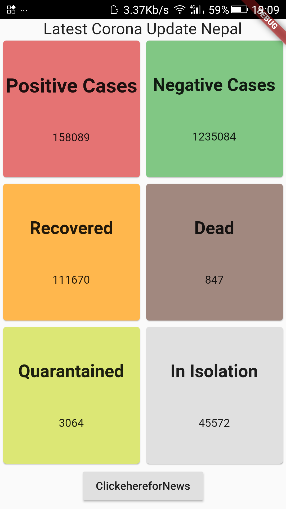
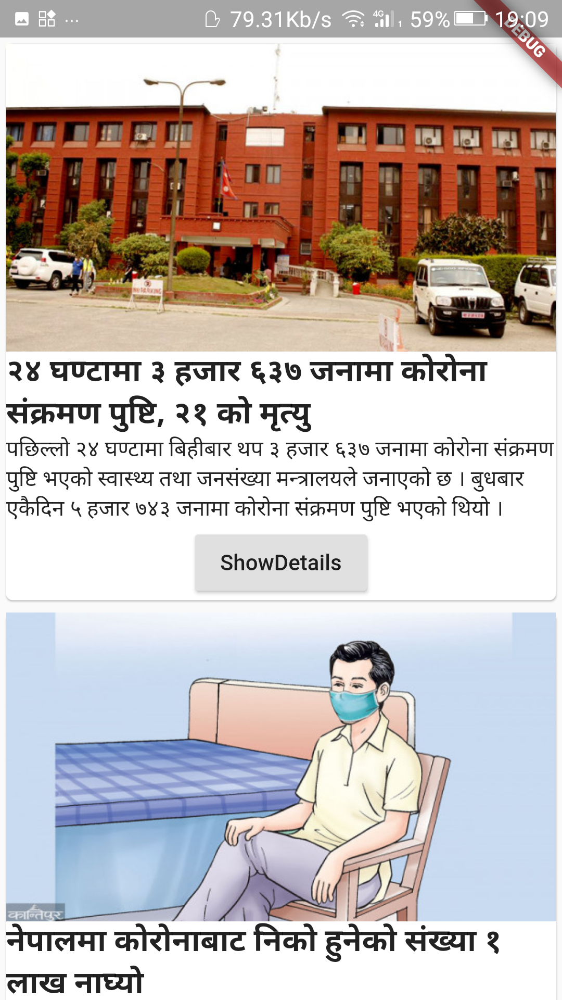

# Nepal Live Corona Tracking App 
* Overview
* App Snapshot
* Motivation
* Tehnical aspect
* Installation
* Updation
* Technologies used

# Overview
This is a mobile application made using flutter sdk using dart language. From this app it will show us the latest updates of the COVID-19 case of Nepal. Similarly, we can see the  latest news about the cases associated with Nepal. I have integrated the API endpoint. The API I used was from https://documenter.getpostman.com/view/9992373/SzS7PkXr?version=latest. Similary, the tutorial for this app is completely explained in English on my channel https://www.youtube.com/watch?v=UQzt_VKOcCY.

# App Snapshots

# Motivation
This app was very interesting choice for me. I was motivated to make an app which can show the latest live cases of COVID-19 of Nepal. My main motivation was from my teacher from UDEMY, Dr.Angela Yu who taught me how to code in this platform. I completd here bootcamp programme and I got an idea to explore the data of COVID_19 and make one simple app. 

# Technical aspect
> An app is built on the top of flutter sdk using dart. Similary, it is linked with API.

# Installation
The code is completely written in dart language and for that I have installed flutter sdk from here https://flutter.dev/?gclid=Cj0KCQjwxNT8BRD9ARIsAJ8S5xaseAhDtZP4vGR-bURa2jP3yByRrT0Pgp4Xq2f1B0LRXiaydcDdNDkaAlJSEALw_wcB&gclsrc=aw.ds

# Technologies used

> Flutter

> Dart

> Vs Code

- ©️ ShyamStha 2021

